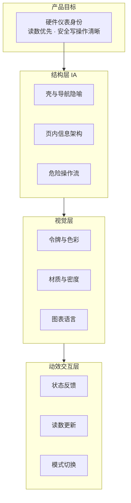

# LongCore UI 全量重设计计划（结构 / 视觉 / 动效）

> 版本 v1.0 · 2026-09-12  
> 前置对话：双向钢人论证 + 四点定案  
> 代码锚点：`JiaoLongControl/Client` + `JiaoLongControl/Server`  
> 状态：**已被取代（形式失效）** —— 经 v3 外部评审判定形式失效，现行方案见 `docs/UI重构_最终方案_v4.md`。
> 保留本文档仅作**决策留痕与误差记录**（视觉身份＝硬件仪表的定案在此首次提出，仍有效）。**禁止据此执行实现。**

---

## 0. 本次对话定案

| 议题 | 结论 |
|---|---|
| 「AI 味」判定对象 | **当前 LongCore（M1 + docs/07 动效已合入）**，不是旧上游印象 |
| 产品代码位置 | 仓库根（`JiaoLongControl/`），后续实现以它为唯一锚点 |
| 视觉身份 | **独立硬件仪表身份**（修订 docs/06 的「Fluent 软约束」） |
| Skills 策略 | **只补缺口、少而精**，不批量镜像 |

---

## 1. 为什么在 M1 + 动效之后仍要全量重做

上一轮（M1 令牌 + docs/07 动效）解决了「赛博辉光、失效动画、无障碍硬伤」，但**没有换掉产品气质**。当前代码仍可举证的 AI 味残留：

| 证据 | 位置 | 问题本质 |
|---|---|---|
| 主色仍是紫罗兰 `#8a2be2` | `assets/Global.scss:19` | AI 生成界面的默认「科技紫」 |
| 蓝紫径向光晕背景 | `style.css:41-56` + `--glow-*` | 着陆页氛围，不是工具面 |
| 玻璃卡 `backdrop-blur-3xl` | `style.css:63-64` `.glass-card` | 材质戏法，削弱信息层级 |
| 假 ECG 10Hz 装饰循环 | `Home.vue:122-176` | 假仪表 = 最强 AI 味信号 |
| 紫渐变主按钮 | `CPU.vue:347`、`GPU.vue:464`、`KeyBoard.vue:339` | 渐变 CTA 膜板 |
| `cyber-*` / `neon-*` 令牌与类 | `style.css:7-75` | 命名即身份：仍在演「赛博」 |
| 左 240px 通用侧栏壳 | `Main.vue:25-78` | SaaS 后台隐喻，不是仪器面板 |
| Arco 默认控件方言 | 全站 | 第三方默认感未被品牌层吸收 |

**结论**：问题不是「再修几个类名」，而是 **产品身份仍是「去毒后的 AI 着陆页」**，需要换成 **硬件仪表 / 精密控制台** 的作者性语言。

---

## 2. 修订 docs/06：视觉身份从 Fluent 克隆 → 硬件仪表

docs/06 曾定「尽量 Win11 Fluent、约 85%、非必须」。本次**正式修订该软约束**：

- **保留**：不换栈（WPF + WebView2 + Vue3）；体积目标；Mica 作为窗口材质手段；Fluent 动效令牌中的「克制时长」原则。
- **放弃**：以「像系统设置」为成功判据。
- **新成功判据**：旁观者第一眼识别为 **蛟龙 16 Pro 的硬件控制仪器**，而不是通用 AI 仪表盘、也不是 Win11 设置克隆。

### 2.1 设计锚点（style anchor）

| 维度 | 锚定 | 明确拒绝 |
|---|---|---|
| 品类 | 游戏本 OEM 控制台的「工程仪表」侧：精密、暗底、读数优先（参考 Armoury Crate / iCUE 的信息密度，但**不用 RGB 灯海**） | Marketing landing、SaaS admin、赛博朋克霓虹 |
| 材质 | 近黑哑光底 + 细发丝分割 + 实心读数面板（可选轻 Mica） | 玻璃拟态、大模糊、多层光晕 |
| 字体 | 数值等宽（`JetBrains Mono` / 系统 mono）+ UI 无衬线（Segoe UI Variable）；tabular-nums | 装饰性衬线、过大 display |
| 色彩 | 中性石墨阶 + **一个**功能强调色（建议冷青/信号橙，由 design-lab 实验决定）+ 温度语义色（已存在，保留） | 紫罗兰主色、彩虹渐变按钮 |
| 几何 | 密度偏高、圆角 4–8、对齐网格、分区靠空间与发丝线 | 大圆角卡片墙、hover 上浮 |
| 动效 | 状态变化可见、读数瞬时、无装饰循环 | 无限脉冲、假波形、页面位移切换 |

---

## 3. 已安装 Skills（缺口补齐）

安装路径：`C:\Users\NullCola\.config\mimocode\skills\`（MiMo Desktop 全局，新对话生效）

| Skill | 用途 | 在本项目中的职责 |
|---|---|---|
| `better-ui` | 打磨原则（圆角同心、阴影分层、按压 scale、禁 `transition:all`） | 视觉/微交互验收尺 |
| `better-layout` | 分组、对齐、阅读序、渐进披露 | **结构层**重设计 |
| `interface-design` | 仪表盘/工具面板 craft | 产品壳与各控制页 |
| `impeccable` | 反通用、完整交付、POV | 总控设计质量与「有作者性」 |
| `design-lab` | 访谈 → 多方案变体 → 选型 | **硬件仪表**方向实验 |

**已有、不重复安装**：`frontend-design`、`improve-ui`、`improve-animations`、`design-blueprint`、`create-design-md`、`baseline-ui`、`emil-design-eng`、`apple-design`、`ui-skills-root`。

### 3.1 Skills 使用纪律

1. **audit 阶段只读**：`improve-ui` / `improve-animations` 出问题清单与计划，不直接改代码。  
2. **direction 阶段**：`design-lab` 产出 2–3 个硬件仪表变体（截图/HTML 原型），用户选定后再写令牌。  
3. **build 阶段**：`interface-design` + `better-layout` + `better-ui` 约束实现；`impeccable` 做收口。  
4. **禁止**把 ui-skills 当设计系统源——设计令牌必须写进本仓 `Global.scss` / `DESIGN.md`，skill 只提供方法。

---

## 4. 三层重设计范围

### 4.1 结构层（先做，决定一切）

**目标**：从「左侧栏 SaaS 壳」改为「仪器面板布局」。

| 项 | 现状 | 目标 |
|---|---|---|
| 壳 | `Main.vue` 左 240px 导航 + 右内容 | 评估：顶部紧凑模式条 + 内容全宽，或窄图标轨 + 主仪表区；**以日常任务路径投票** |
| 首页 Home | 监控环 + 模式胶囊 + 假 ECG + 杂项卡 | **驾驶舱**：常驻关键读数（温度/风扇/模式/功耗）一眼可读；详情下钻，删除假 ECG |
| 控制页 CPU/GPU/Fan/Keyboard/SMU | 各页卡片堆叠风格不一 | 统一「模块 = 读数头 + 控件 + 应用确认」三段式 |
| 设置 | 卡片列表 | 分组：系统 / 外观 / 驱动 / 高级；危险项二次确认 |
| 写操作 | 渐变按钮 + Message toast | 明确「待应用 / 已应用 / 失败」状态机，失败可撤销或回读 |

**产出物**：信息架构图 + 每页 wireframe（可在 design-lab 变体中并行）。

### 4.2 视觉层

**必须拆除**

- `--color-accent-purple` 主色地位 → 降为可选或删除  
- `--glow-*` 与 `style.css` 多层 `radial-gradient` 背景  
- `.glass-card` 玻璃模糊  
- `.neon-*`、`cyber-*` 命名与视觉  
- 紫渐变 apply 按钮、Arco switch 强制紫底  

**必须建立**（写入 `Global.scss`，并可选落 `DESIGN.md`）

| 令牌组 | 要求 |
|---|---|
| 表面 | `bg-app` / `bg-panel` / `bg-raised` / `bg-inset`，实心或极轻透明，禁大 blur |
| 墨色 | 主/次/弱/禁用；数值用 mono + tabular-nums |
| 强调 | **单一** accent（待 design-lab 选型）；焦点环、选中、主操作共用 |
| 语义 | 温度四档保留；警告/危险/成功与硬件安全语义对齐 |
| 分割 | 发丝线 `1px`，优先空间分组（`better-layout`） |
| 图表 | ECharts 主题重做：无霓虹、面积低透明度、网格弱化 |

**保留并强化**：温度语义色阶与滞回（`temperature.ts`）、Lucide 线性图标、动效时长上限 250ms 的克制原则。

### 4.3 动效 / 交互层

docs/07 已建立的令牌与「读数零过渡」原则**继续有效**，本轮只补身份相关项：

| 场景 | 规则 |
|---|---|
| 导航 / 模式切换 | 150ms 色变或内容交叉，禁止位移整页 |
| 读数（温度/转速/频率） | **瞬时**（继承 docs/07） |
| 应用成功 | 模块边框或状态点一次性确认（已部分实现，统一到新 accent） |
| 曲线拖拽 | 零过渡跟手 |
| 装饰动画 | **零**；删除 ECG、无限 spin/pulse（加载态除外） |
| reduced-motion | 继续全局覆盖 |

---

## 5. 分阶段执行（依赖顺序）

### Phase A · 方向实验（0.5–1 天，阻塞后续）

1. 用 `design-lab` / `impeccable`：访谈补充 2–3 个关键偏好（强调色倾向、密度、是否保留左轨）。  
2. 产出 **2–3 个硬件仪表 HTML/截图变体**（同一 Home 驾驶舱信息架构）。  
3. 用户选定 1 个方向 → 写入本计划附录 A（冻结视觉决策）。  

**不做**：此时不改生产代码。

### Phase B · 设计系统地基（1–2 天）

1. 编写/更新根目录 `DESIGN.md`（可用已有 `create-design-md` 从当前仓反推基线，再覆盖新决策）。  
2. 重写 `Global.scss` / `style.css` 令牌层；删除 cyber/glow/glass/neon。  
3. WPF 侧：Mica + WebView2 透明底（若 Phase A 选用 Mica）；标题栏对齐新身份。  
4. `npm run build` 通过；灰度对比截图。

### Phase C · 壳与首页驾驶舱（2–3 天）

1. 按选定 IA 改 `Main.vue` / `TitleBar.vue` / `RightSide.vue`。  
2. 重做 `Home.vue`：删 ECG；读数优先布局；模式条融入仪表语言。  
3. `StatusBanner` / `CoreMonitoring` 视觉对齐新令牌。  

### Phase D · 控制页模板化（3–5 天）

1. 抽出统一「控制模块」组件（读数头 + 控件 + 应用状态）。  
2. 依次迁移：Fan → CPU → GPU → KeyBoard → RyzenSmu → Settings。  
3. 危险写操作（EC/SMU）强化确认与失败回读 UI。  

### Phase E · 动效与收口（1–2 天）

1. 按 `better-ui` / `improve-animations` 清单验收微交互。  
2. Arco 覆盖层补全（switch/modal/message 与新令牌一致）。  
3. 真机：焦点环、reduced-motion、主题切换无拖影、曲线拖拽帧率。  
4. 更新 `docs/06` 修订记录与 TODO 里程碑。

---

## 6. 非目标（明确不做）

- 不更换技术栈（WinUI3 / Tauri 等）  
- 不重新逆向协议、不改 WMI/EC 语义  
- 不做 RGB 键盘灯海视觉克隆  
- 不为「惊艳」加 WebGL/粒子背景  
- 不在未选型前写死强调色到生产令牌  

---

## 7. 验收清单（Definition of Done）

- [ ] 旁观者盲测：不说是 LongCore 时，能联想到「硬件控制/仪表」而非「AI 生成网页」 — **待真机盲测**
- [x] 全站无 `accent-purple` 主色地位、无 `glow-*` 消费、无玻璃 blur 卡、无假波形
- [x] 首页 3 秒内可读：CPU/GPU 温度、风扇、当前性能模式
- [x] 任一写操作：应用前可预览变更，应用后有明确成功/失败态 — **`useApplyState` + `ApplyBar` 状态机已落地；Fan 为参考实现**
- [x] `npm run build` 通过；焦点环键盘可达；reduced-motion 生效
- [x] `DESIGN.md` 与 `Global.scss` 令牌一致，无并行体系

### 2026-09-16 进度

| Phase | 状态 | 说明 |
|---|---|---|
| A 方向实验 | **完成** | 冻结 Variant A 读数机架 |
| B 设计系统地基 | **完成** | DESIGN.md + Global.scss/style.css 令牌层 |
| C 壳与首页 | **完成** | 60px 图标轨 + Home 读数机架，删 ECG |
| D 控制页模板化 | **完成（核心）** | `ControlModule`/`ApplyBar`/`useApplyState`/`PageShell`；Fan 全量参考实现；设置分组；全站 panel-card；紫渐变/滑条/开关/Arco 覆盖对齐冷青 |
| E 动效收口 | **完成（代码侧）** | Arco modal/message/btn/slider 全局覆盖；无 `:deep` 残留；真机验收仍待用户在目标机确认 |

### 后续建议（非阻塞）

1. CPU/GPU/KeyBoard/RyzenSmu 按 Fan 模式迁移到 `ControlModule` + `ApplyBar`（逻辑已通，壳层替换）  
2. 目标机盲测 + 焦点环 / reduced-motion / 曲线拖拽帧率  
3. 注释中残留的个别乱码字符（不影响编译）可在下轮顺手清理  
4. `Global.scss` 迁移别名（`--color-accent-purple` 等）在控制页类名清零后删除

---

## 8. 风险与回滚

| 风险 | 缓解 |
|---|---|
| 一次改壳导致导航回归（docs/07 曾有顺序事故） | 分 Phase 提交；壳改动单独分支/commit；连点导航冒烟 |
| Arco 覆盖不全导致「新旧两张皮」 | Phase E 专项；必要时降级为「少用 Arco 装饰组件」 |
| 强调色选型反复 | Phase A 冻结后再动令牌；令牌层与页面层分离便于换色 |
| 并发清空 `Client/src` 事故史 | 整文件原子写 + 构建通过后立刻 commit（沿用既有纪律） |

---

## 附录 A · 视觉决策冻结表（Phase A 填写）

| 项 | 选定值 | 日期 |
|---|---|---|
| 变体 ID | **A · 读数机架**（`.design-lab/variant-a-readout-rack.html`） | 2026-09-16 |
| 强调色 | **冷青 `#22d3ee`**（焦点环 / 选中 / 主操作共用） | 2026-09-16 |
| 壳布局 | **窄图标轨 60px** + 顶部 48px 状态条（模式分段 + 温度 chip + 功耗/风扇/噪音 meta） | 2026-09-16 |
| 窗口材质 | **近黑哑光纯色**（`#0a0b0f`）；Mica 可选，Phase B 不强制 | 2026-09-16 |
| 密度档 | **compact** | 2026-09-16 |
| 首页结构 | 四格大号 mono 读数机架（CPU/GPU 温、Fan Max、Package Power）+ 风扇条 + 弱化曲线 + 系统条；**删除假 ECG** | 2026-09-16 |
| 表面 | `bg-app/panel/raised/inset` 实心，禁大 blur；发丝线 `1px` 分区 | 2026-09-16 |
| 数值字体 | mono + `tabular-nums`（JetBrains Mono / Cascadia Code / Consolas 回退） | 2026-09-16 |
| 明确拒绝 | 紫罗兰主色、玻璃卡、径向光晕、neon/cyber 命名、假波形、彩虹渐变按钮 | 2026-09-16 |

## 附录 B · Skills 与文档索引

- 安装位置：`~/.config/mimocode/skills/{better-ui,better-layout,interface-design,impeccable,design-lab}/`  
- 历史定案：`docs/06_决策记录.md`（栈不动；Fluent 软约束**已修订**）  
- 动效遗产：`docs/07_动效原则.md`（读数瞬时、令牌档位继续有效）  
- 代码根：`JiaoLongControl/Client/src/`  
